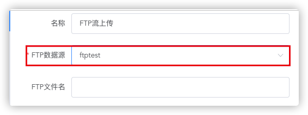
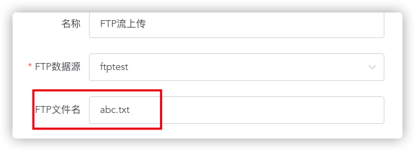
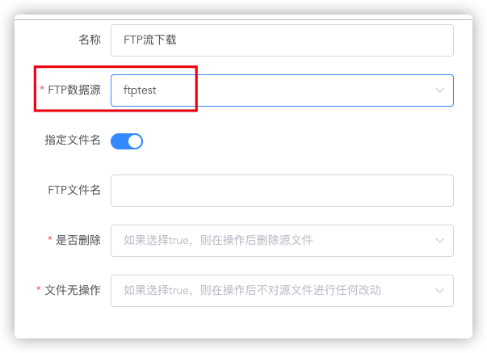
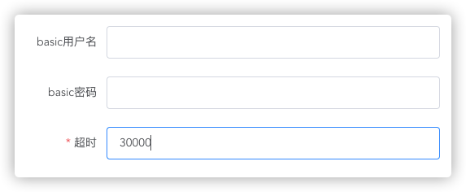
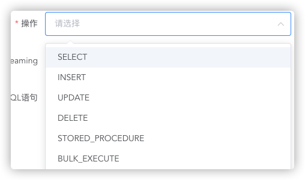
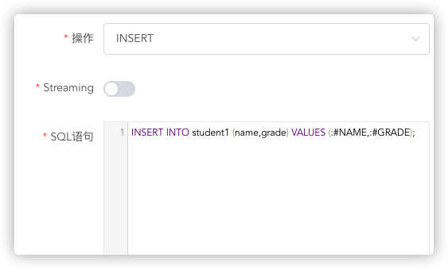
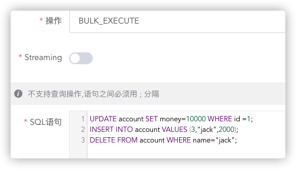
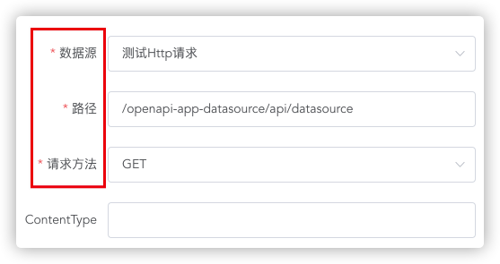
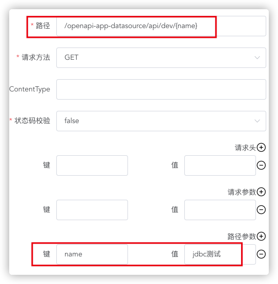
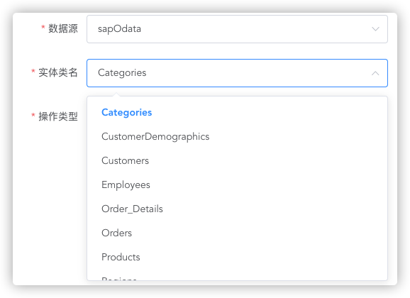

# JOMA DOCUMENTATION

## 1. ESB CONNECTORS

### 1.1 PRODUCERS

---

#### 1.1.1 微信

**概要**：`微信组件`将传入`Message`的`body` 发送至 `企业微信` ， 并且将传入的`Message`流入`下一节点`

**使用方法**：

 1. > 选择数据源中配置好的微信数据源并保存
    >
    > 

---

#### 1.1.2 钉钉

**概要**：`钉钉组件`将传入`Message`的`body` 发送至 `钉钉` ， 并且将传入的`Message`流入`下一节点`

**使用方法：**

 1. > 选择数据源中配置好的微信数据源并保存
    >
    > 

---

#### 1.1.3 FTP流上传

**概要**：`FTP流上传组件`将传入`Message`的`body` 以字节流的形式发送至 `FTP服务器` ， 并且将传入的`Message`流入`下一节点`

**使用方法：**

1. > 配置数据源中配置好的FTP数据源
   >
   > 

2. > 键入上传文件名
   >
   > 

---

#### 1.1.4 FTP流下载

**概要**：`FTP流下载组件`将`FTP服务器`上的文件以`字节流`形式下载并保存在`内存`中 ， 流入`下一节点`

**使用方法：**

1. > 选择数据源中配置好的数据源
   >
   > 

2. > 选择文件匹配模式
   >
   > 1. 指定文件名
   >
   > 
   >
   > 2. 过滤模式
   >
   > * 过滤模式根据`File语法`进行文件匹配，关于`File语法`详见`语法 - File`
   >
   > * 过滤模式可以匹配多个文件
   >
   > 

3. > 选择是否在下载完成后删除
   >
   > 

4. > 选择是否无操作，如果选择是，文件**无论如何**也不会移动或删除，并且或自动保证`幂等性`，防止**重复消费**，
   >
   > 如果想要**重复下载**文件，请将`是否删除` 和 `文件无操作` 都设置为**false**
   >
   > 

---

#### 1.1.5 SFTP流上传

**概要**：`SFTP流上传组件`将传入`Message`的`body` 以字节流的形式发送至 `SFTP服务器` ， 并且将传入的`Message`流入`下一节点`

**使用方法:**

与  [FTP流上传](####1.1.3 FTP流上传 )  相同 

#### 1.1.6 SFTP流下载

**概要**：`SFTP流下载组件`将`SFTP服务器`上的文件以`字节流`形式下载并保存在`内存`中 ， 流入`下一节点`

**使用方法：**

与[FTP流下载](####1.1.4 FTP流下载 ) 相同

---

#### 1.1.7 SOAP

**概要**：`SOAP组件`  将传入`Message `的 `body `作为请求体 向`远端Webservice`服务发起请求，并将响应流入`下一节点`

**使用方法：**

1. > 选择在数据源中配置好的ws数据源

   

2. > 根据ws数据源会自动带出操作列表，选择需要进行的操作
   >
   > 

3. > 配请求超时时间（毫秒）。如有安全认证，可配置相应的basic认证用户名密码。
   >
   > 

4. > 也可以不从传入`Message`获取soap body 。 配置自定义soap body
   >
   > 

   

---

#### 1.1.8 SQL

**概要**：`SQL组件`  在指定jdbc数据库 执行sql语句，并将结果流入`下一节点`

**使用方法：**

1. > 选择数据库类型
   >
   > 

2. > 根据数据库类型选择相应数据源
   >
   > 

3. > 选择是否以流读取结果（流只能被读取一次），返回类型为Iterator
   >
   > 

4. > 选择操作类型
   >
   > 
   >
   > 
   >
   > 
   >
   > > - **SELECT** 
   > >
   > > 
   > >
   > >   - 查询操作会返回List<Map<String,Object>>
   > >   - 通过`:#variable` 来传入变量
   > >   - `:#variable`先从传入`Message`的`body`寻找（Map类型），寻找不到会从`Message`的`Header`寻找
   > >
   > >   
   > >
   > > - **INSERT UPDATE DELETE**
   > >
   > >   - 增删改操作会返回Double类型影响行数
   > >
   > >   
   > >
   > > - **STORED_PROCEDURE** 存储过程
   > >
   > >   - SQL语句示例 ： `STOREDSAMPLE(INTEGER ${headers.num1},INTEGER ${headers.num2},INOUT INTEGER ${headers.num3} result1,OUT INTEGER result2)`
   > >   - STOREDSAMPLE 为存储过程名
   > >   - 每个参数前需要加上`SQL TYPE`
   > >   - IN类型参数不需要加前缀，其他类型 需要加上前缀
   > >   - 传入变量使用`SIMPLE语言`  详见 `语言-SIMPLE`
   > >   - 返回类型为map 结构示例
   > >
   > >   
   > >
   > > 
   > >
   > > - **BULK_EXECUTE**
   > >
   > >   - 可以批量执行**INSERT UPDATE DELETE**操作，语句之间以`;`分割
   > >   - 返回影响行数List
   > >   - 注意！批量执行**非原子性**操作，不能回滚。
   > >   
   > >   

---

#### 1.1.9 HTTP Request

**概要**：` HTTP Request组件`  发起 HTTP 请求，并将响应结果流入`下一节点`

**使用方法：**

1. > 选择HTTP数据源、请求方法，键入请求路径。
   >
   > 

2. > 选择是否需要校验状态码
   >
   > - true - 状态码非200 会直接报错

3. > 可添加请求头（注意： 传入`Message`的`Headers`也会作为请求头，如有不需要的 `Header` 请使用 `Remove Head`组件）
   >
   > 

4. > 可选配置 Query Param
   >
   > 

5. > 可选配置restful风格  `Path Variable`
   >
   > 

6. > 可选配置请求体，如不配置，则使用传入`Message body`
   >
   > 

7. >  可选配置安全配置
   >
   > 

---

#### 1.1.10 SAP ODATA

**概要**：`SAP ODATA组件`将操作`SAP ODATA` 数据库 ， 并且将响应结果流入`下一节点`

**使用方法:**

1. > 选择数据源，选择后会自动带出实体类名（entity type）列表
   >
   > 

2. > 选择操作类型并配置
   >
   > 
   >
   >  
   >
   >  
   >
   > - **CREATE ENTITY**
   >
   >   - 期待传入`Message Body`类型为`Object`
   >
   >   - 可通过`Transformer`组件获取期待入参
   >
   >     

---

