# JOMA DOCUMENTATION

## 1. ESB CONNECTORS

### 1.1 PRODUCERS

---

#### 1.1.1 微信

**概要**：`微信组件`将传入`Message`的`body` 发送至 `企业微信` ， 并且将传入的`Message`流入`下一节点`

**使用方法**：

 1. > 选择数据源中配置好的微信数据源并保存
    >
    > 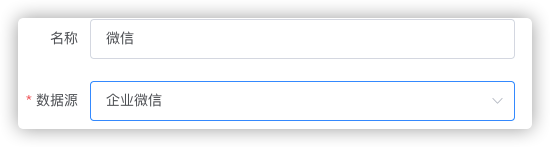

---

#### 1.1.2 钉钉

**概要**：`钉钉组件`将传入`Message`的`body` 发送至 `钉钉` ， 并且将传入的`Message`流入`下一节点`

**使用方法：**

 1. > 选择数据源中配置好的微信数据源并保存
    >
    > 

---

#### 1.1.3 FTP流上传

**概要**：`FTP流上传组件`将传入`Message`的`body` 以字节流的形式发送至 `FTP服务器` ， 并且将传入的`Message`流入`下一节点`

**使用方法：**

1. > 配置数据源中配置好的FTP数据源
   >
   > 

2. > 键入上传文件名
   >
   > 

---

#### 1.1.4 FTP流下载

**概要**：`FTP流下载组件`将`FTP服务器`上的文件以`字节流`形式下载并保存在`内存`中 ， 流入`下一节点`

**使用方法：**

1. > 选择数据源中配置好的数据源
   >
   > 

2. > 选择文件匹配模式
   >
   > 1. 指定文件名
   >
   > 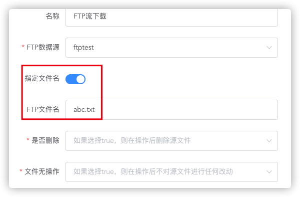
   >
   > 2. 过滤模式
   >
   > * 过滤模式根据`File语法`进行文件匹配，关于`File语法`详见`语法 - File`
   >
   > * 过滤模式可以匹配多个文件
   >
   > 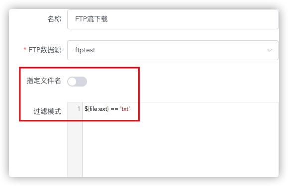

3. > 选择是否在下载完成后删除
   >
   > 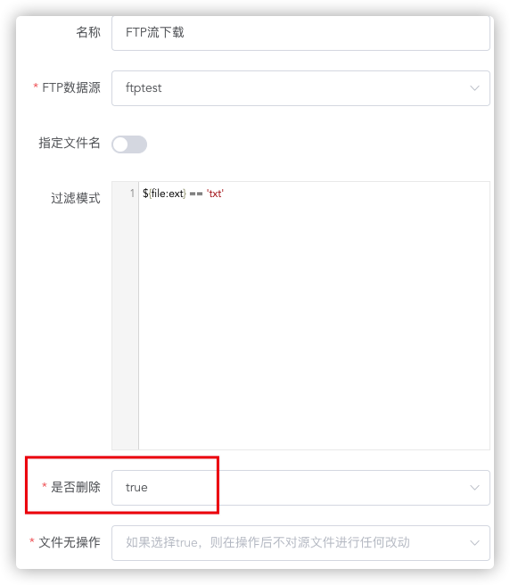

4. > 选择是否无操作，如果选择是，文件**无论如何**也不会移动或删除，并且或自动保证`幂等性`，防止**重复消费**，
   >
   > 如果想要**重复下载**文件，请将`是否删除` 和 `文件无操作` 都设置为**false**
   >
   > 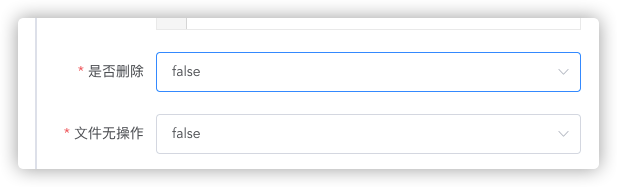

---

#### 1.1.5 SFTP流上传

**概要**：`SFTP流上传组件`将传入`Message`的`body` 以字节流的形式发送至 `SFTP服务器` ， 并且将传入的`Message`流入`下一节点`

**使用方法:**

与  [FTP流上传](####1.1.3 FTP流上传 )  相同 

#### 1.1.6 SFTP流下载

**概要**：`SFTP流下载组件`将`SFTP服务器`上的文件以`字节流`形式下载并保存在`内存`中 ， 流入`下一节点`

**使用方法：**

与[FTP流下载](####1.1.4 FTP流下载 ) 相同

---

#### 1.1.7 SOAP

**概要**：`SOAP组件`  将传入`Message `的 `body `作为请求体 向`远端Webservice`服务发起请求，并将响应流入`下一节点`

**使用方法：**

1. > 选择在数据源中配置好的ws数据源

   

2. > 根据ws数据源会自动带出操作列表，选择需要进行的操作
   >
   > 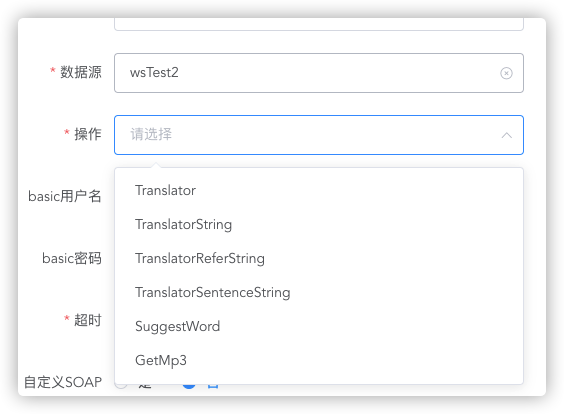

3. > 配请求超时时间（毫秒）。如有安全认证，可配置相应的basic认证用户名密码。
   >
   > 

4. > 也可以不从传入`Message`获取soap body 。 配置自定义soap body
   >
   > 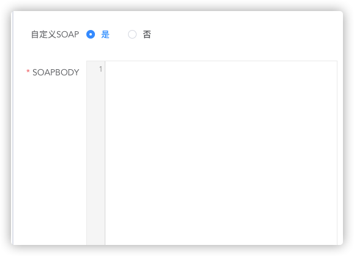

   

---

#### 1.1.8 SQL

**概要**：`SQL组件`  在指定jdbc数据库 执行sql语句，并将结果流入`下一节点`

**使用方法：**

1. > 选择数据库类型
   >
   > 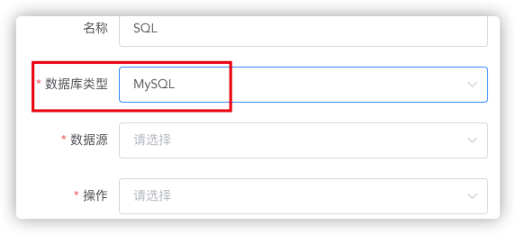

2. > 根据数据库类型选择相应数据源
   >
   > 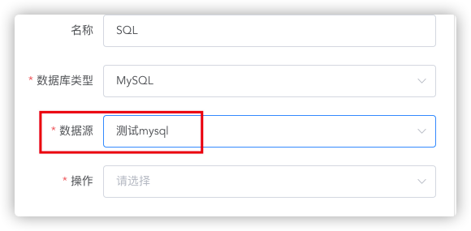

3. > 选择是否以流读取结果（流只能被读取一次），返回类型为Iterator
   >
   > 

4. > 选择操作类型
   >
   > 
   >
   > 
   >
   > 
   >
   > > - **SELECT** 
   > >
   > > 
   > >
   > >   - 查询操作会返回List<Map<String,Object>>
   > >   - 通过`:#variable` 来传入变量
   > >   - `:#variable`先从传入`Message`的`body`寻找（Map类型），寻找不到会从`Message`的`Header`寻找
   > >
   > >   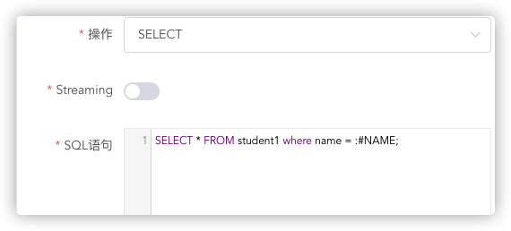
   > >
   > > - **INSERT UPDATE DELETE**
   > >
   > >   - 增删改操作会返回Double类型影响行数
   > >
   > >   
   > >
   > > - **STORED_PROCEDURE** 存储过程
   > >
   > >   - SQL语句示例 ： `STOREDSAMPLE(INTEGER ${headers.num1},INTEGER ${headers.num2},INOUT INTEGER ${headers.num3} result1,OUT INTEGER result2)`
   > >   - STOREDSAMPLE 为存储过程名
   > >   - 每个参数前需要加上`SQL TYPE`
   > >   - IN类型参数不需要加前缀，其他类型 需要加上前缀
   > >   - 传入变量使用`SIMPLE语言`  详见 `语言-SIMPLE`
   > >   - 返回类型为map 结构示例
   > >
   > >   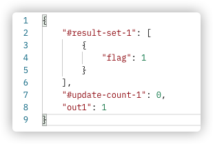
   > >
   > > 
   > >
   > > - **BULK_EXECUTE**
   > >
   > >   - 可以批量执行**INSERT UPDATE DELETE**操作，语句之间以`;`分割
   > >   - 返回影响行数List
   > >   - 注意！批量执行**非原子性**操作，不能回滚。
   > >   
   > >   

---

#### 1.1.9 HTTP Request

**概要**：` HTTP Request组件`  发起 HTTP 请求，并将响应结果（类型为`byte数组`）流入`下一节点`

**使用方法：**

1. > 选择HTTP数据源、请求方法，键入请求路径。
   >
   > 

2. > 选择是否需要校验状态码
   >
   > - true - 状态码非200 会直接报错

3. > 可添加请求头（注意： 传入`Message`的`Headers`也会作为请求头，如有不需要的 `Header` 请使用 `Remove Head`组件）
   >
   > 

4. > 可选配置 Query Param
   >
   > 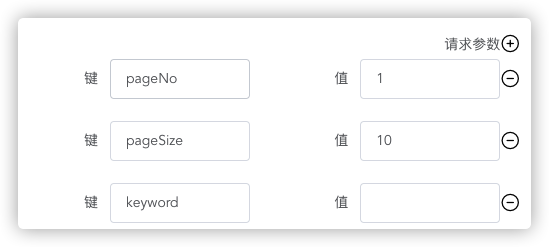

5. > 可选配置restful风格  `Path Variable`
   >
   > 

6. > 可选配置请求体，如不配置，则使用传入`Message body`
   >
   > 

7. >  可选配置安全配置
   >
   > 

---

#### 1.1.10 SAP ODATA

**概要**：`SAP ODATA组件`将操作`SAP ODATA` 数据库 ， 并且将响应结果流入`下一节点`

**使用方法:**

1. > 选择数据源，选择后会自动带出实体类名（entity type）列表
   >
   > 

2. > 选择操作类型并配置
   >
   > 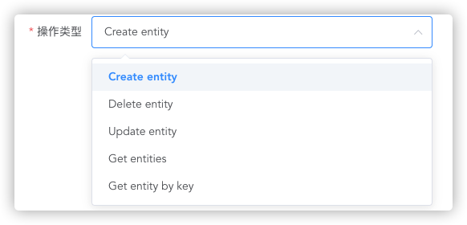
   >
   > 
   >
   > 
   >
   > - **CREATE ENTITY**
   >
   >   - 期待传入`Message Body`类型为`Object`
   >   - 可通过`Transformer`组件获取期待入参 
   >   
   >   
   >   
   > - **DELETE ENTITY**
   >
   >   -  键入主键来删除实体类
   >   - 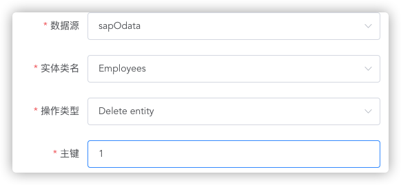
   >
   > - **UPDATE ENTITY**
   >
   >   - 期待传入`Message Body`类型为`Object`
   >   - 键入主键来更新实体类
   >
   > - **GET ENTITY**
   >
   >   - 根据条件获取实体类
   >   - 可通过`Transformer`组件获取出参元数据
   >   - 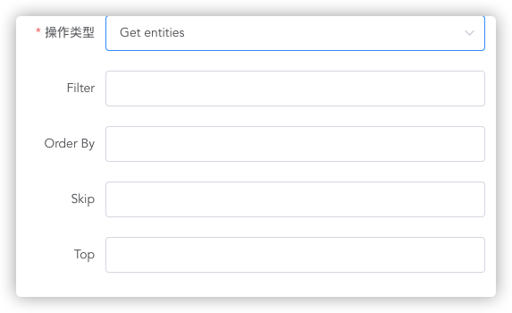
   >
   > - **GET ENTITY BY KEY**
   >
   >   - 根据主键获取实体类
   >   - 可通过`Transformer`组件获取出参元数据
   >   - 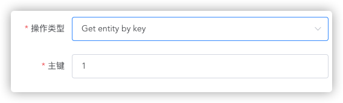
   >
   
   
   

---

#### 1.1.11 BATCH SQL

**概要**：`BATCH SQL组件`可以批量进行`jdbc数据库` 增删改操作，并返回操作影响行数。

**使用方法:**

1. > 选择数据库类型、数据源、操作类型
   >
   > 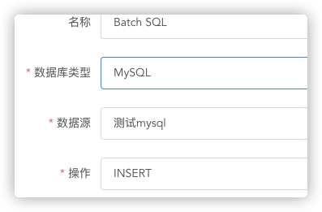

2. > 输入sql语句，变量用法 与 `SQL组件`相同
   >
   > 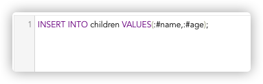

3. > 注意：若使用`:#变量` ,要求传入`Message Body` 类型为`List<Map<String,Object>>`
   >
   > 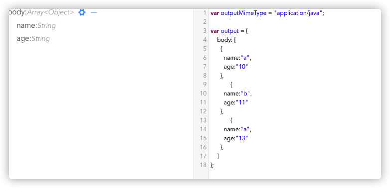

---

#### 1.1.12 SAP

**概要**：`SAP组件`可以连接SAP操作，并返回操作结果。

**使用方法：**

1. > 选择sap数据源

2. > 键入BAPI函数
   >
   > 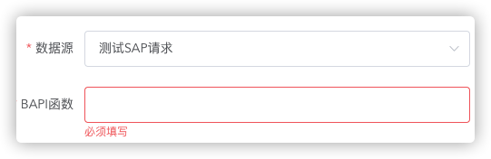

---

#### 1.1.13 RabbitMQ

**概要**：`RabbitMQ Producer`可以向`RabbitMQ`发送消息。

**使用方法：**

1. > 选择RabbitMQ数据源
   >
   > 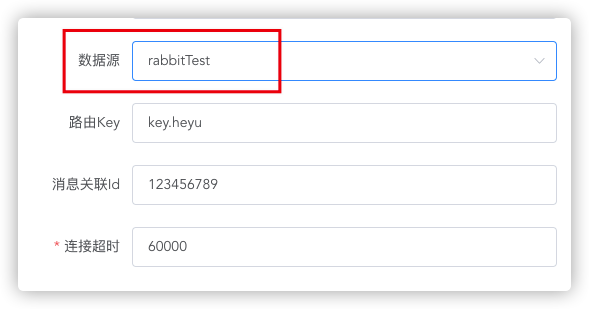

2. > 根据MQ工作模式可选键入Routing Key
   >
   > 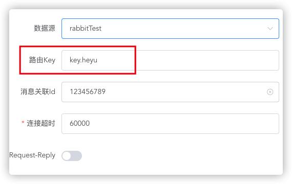

3. > 可选键入CorrelationID 
   >
   > 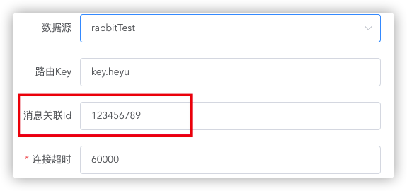

4. > 配置发送超时时间（毫秒）
   >
   > 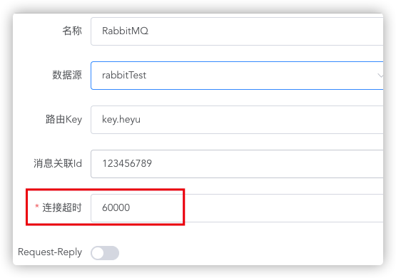

5. > 选择是否开启`Request-Reply`模式
   >
   > - 开启`Request-Reply`模式
   >
   >   - 配置等待回复超时时间（毫秒）
   >   - 开启后，该组件会自动创建一个队列， 并会在消息中添加两个property：`reply_to`和`correlation_id`
   >
   >   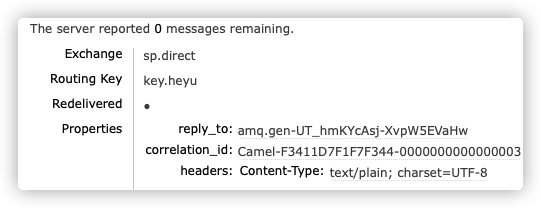
   >
   >   - 如果使用`RabbitMQ Consumer`接收消息，`reply_to`和`correlation_id` 会出现在`Message Headers`中
   >
   >     key分别为 `CamelRabbitmqReplyTo`和`CamelRabbitmqCorrelationId`
   >
   >     
   >
   >   - 只有在等待回复超时时间内收到相同`routing-key` 和 `correlation_id` 回复，才会继续向后路由

---

#### 1.1.14 RocketMQ

**概要**：`RocketMQ Producer`可以向`RocketMQ`发送消息。

**使用方法：**

1. > 选择RocketMQ数据源
   >
   > 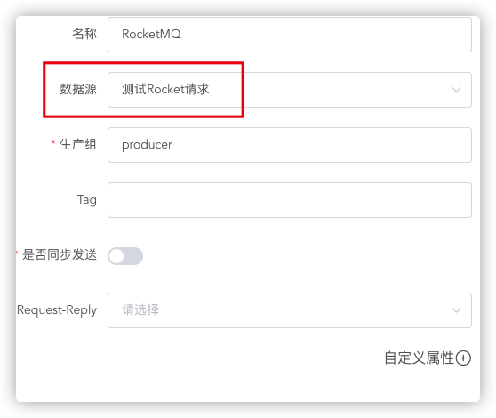

2. > 配置Producer Group
   >
   > 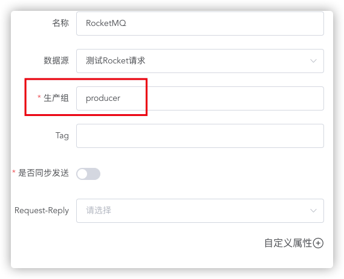

3. > 可选输入tag
   >
   > 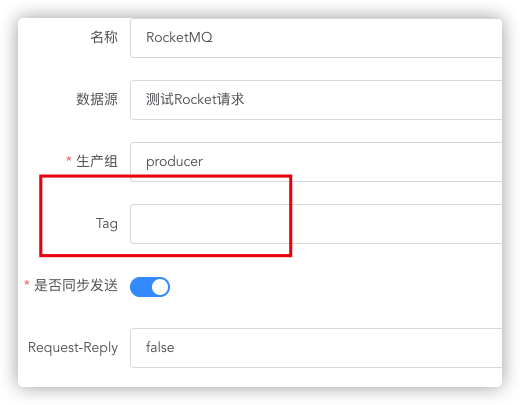

4. > 选择发送模式为**异步**或**同步**
   >
   > 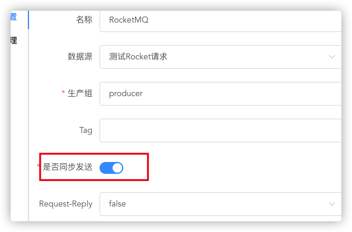

5. > 可选添加消息的额外属性（`RocketMQ Consumer`组件可通过额外属性进行消息筛选）
   >
   > 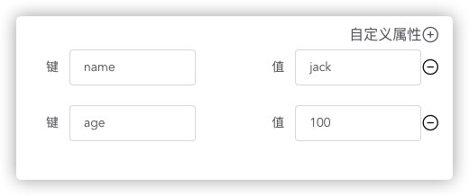

6. > 选择是否开启`Request-Reply`模式
   >
   > - 开启`Request-Reply`模式
   >
   >   - 配置Reply Topic
   >
   >   - 配置Reply Consumer Group
   >
   >   - 配置等待回复超时时间（毫秒）
   >
   >   - 开启后，发送消息中会包含一个唯一`key`和一个property `rocketmq.REPLY_TO `
   >
   >     
   >
   >   - 如果使用`RocketMQ Consumer`接收消息，`key`和`rocketmq.REPLY_TO` 会出现在`Message Headers`中
   >
   >     key分别为 `rocketmq.KEY`和`rocketmq.REPLY_TO`
   >
   >   - 只有在等待回复超时时间内收到相应`Topic` 和 `Message Key` 回复，才会继续向后路由

---

#### 1.1.15 KAFKA

**概要**：`Kafka Producer`可以向`Kafka Broker`发送消息。

**使用方法**：

1. > 指定KAFKA数据源

2. > 指定发送超时时间
   >
   > 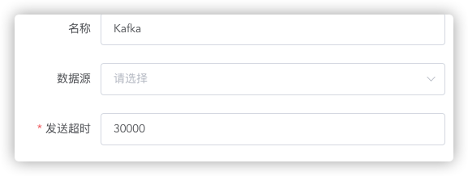

---

### 1.2  SCRIPT ENGINE

#### 1.2.1 支持语言

- **Python**
- **Javascript**
- **Ruby**
- **Groovy**

#### 1.2.2 ScriptContext

Script中存在的定义好的变量，可以直接使用，无需定义。

| Attribute    | Type                          | Value                    |
| ------------ | ----------------------------- | ------------------------ |
| camelContext | org.apache.camel.CamelContext | The Camel Context        |
| exchange     | org.apache.camel.Exchange     | 一次执行过程中的Exchange |
| request      | org.apache.camel.Message      | 当前组件流入的Message    |

注：Exchange 中 可以使用 setProperty(String, Object) 以及 getProperty(String) 存储和获取全局变量。

#### 1.2.3 多行脚本

多行脚本使用 `result=` 获取最终结果并放入`Message Body`

---

### 1.3 GENERICS

---

#### 1.3.1 Set Payload

**概要**：`SET PAYLOAD`可以 设置 `Message` 的 `Body`。

**使用方法**：

1. > 选择编码（encoding）

2. > 选择消息类型（Content-Type）

3. > 键入表达式 使用groovy语法
   >
   > Groovy语法支持  §1.2.2 中的所有ScriptContext

---

#### 1.3.2 Set Header

**概要**：`SET HEADER`可以 设置 `Message` 的 `Header`。

**使用方法**：

1. > 键入key-value   Value使用groovy语法
   >
   > Groovy语法支持  §1.2.2 中的所有ScriptContext

---

#### 1.3.3 Remove Header

**概要**：`Remove Header`可以 移除 `Message` 的 `Header`。

**使用方法**：

1. > 键入需要移除的Header的key

---

#### 1.3.4 Logger

**概要**：`Logger`可以 进行日志的打印。

**使用方法**：

1. > 键入消息 使用groovy语法
   >
   > Groovy语法支持  §1.2.2 中的所有ScriptContext

2. > 选择日志等级

3. > 可选输入日志类别

---

### 1.4 FILTERS

---

#### 1.4.1 支持断言(返回值为boolean)

- **JsonPath**
- **Xpath**
- **Groovy**

相关Language详见`语法`

---

#### 1.4.2 使用方法

相关断言为**FALSE**时流程继续，否则停止。

---

### 1.5 TRANSFORMER

---

#### 1.5.1 Object2String

**概要**：将`Message` 的 `Body`  转换为 String 类型。

**使用方法**：

1. > 选择字符集, 例如byte数组转换string时使用。

---

#### 1.5.2 Object2Json

**概要**：将`Message` 的 `Body`  序列化为 Json String。

**使用方法**：

1. > 选择是否Pretty Print。

2. > 选择序列化时使用的库。

---

#### 1.5.3 XML2JSON

**概要**：将`Message` 的 `Body`  由XML 转换为  JSON。

**使用方法**：

1. > 选择字符集。

---

#### 1.5.4 JSON2XML

**概要**：将`Message` 的 `Body`  由 JSON 转换为 XML。

注意，由于xml必须有根节点，源json必须有为object且第一层只能存在**一个属性**。

**使用方法**：

1. > 选择字符集。

---

#### 1.5.5 TRANSFORM

**概要**：支持以可视化的方式以及右侧javascript脚本 配置`Message` 的 `Body`  的转换。

**MimeType:**  定义输入(`inputMimeType`)及输出(`outputMimeType`)的数据格式或类型。

| Type                                       | Description                                                  |
| ------------------------------------------ | ------------------------------------------------------------ |
| application/json                           | JSON格式                                                     |
| application/xml                            | XML格式                                                      |
| application/java                           | JAVA Object 类型                                             |
| application/csv separator=',',header=false | CSV格式， separator为char类型分隔符，header为boolean类型表示是否有头 |
| application/excel sheet=0,header=true      | EXCEL格式, sheet为int类型sheet index，header为boolean类型表示是否有头 |

**Namespaces:** 仅当`MimeType`为`application/xml`时定义。

格式案例

~~~javascript
var namespaces = [{
    prefix: "ns0",
    uri: "http://WebXml.com.cn/"
},
                 {
    prefix: "ns1",
    uri: "http://Leaf.com.cn/"
}];
~~~

进行映射时，在对应的属性前加上<prefix>$即可

案例:

~~~javascript
var output = {
    body: {
        ns0$getSupportCity: {
            ns0$byProvinceName: body
        }
    }
};
~~~

---

### 1.6 CONSUMERS

消费者置放于每个Flow的最前端，且每个Flow仅有一个消费者。

---

#### 1.6.1 HTTP

**概要**：类似于RestController 会监听配置的端口(默认为`7070`)与映射路径。

Request Header 存储在 `Message Headers `中， Request Body  以 **byte数组**的形式 存储 在 `Message Body`  中。

`<IP/域名> ： <端口号> / <项目名称> / 映射路径 `

**使用方法**：

1. > 选择消费的请求方法。

2. > 键入 映射路径， 需要加上`\`。

---

#### 1.6.2 QUARTZ

**概要**：定时器组件。 可以使用cron表达式或固定间隔定时触发flow的运行。

**使用方法**：

1. > 选择使用Cron表达式 或者 固定间隔 触发

2. > >  如果选择Cron的方式， 可以使用配置器进行Cron的配置。
   > >
   > >  也可以使用手动输入的方式。
   >
   > > 如果选择固定间隔的方式，则需输入间隔时间（毫秒）

3. > >   如果选择Cron的方式, 输入当前所在的时区。
   >
   > > 如果选择固定间隔的方式，则输入最大执行次数，0为不限次数。

4. > 选择是否允许并行。不允许的情况下，上次任务未执行完成将不会进行本次任务的执行。

5. > 可选输入启动延迟，建议配置500ms延迟等待组件加载。

---

#### 1.6.3 ROCKETMQ

**概要**：RocketMQ消费者。 可以从RocketMQ消费消息并以 **byte数组**的形式传入

**使用方法**：

1. > 拉取数据源。

2. > 输入消费组。

3. > 选择是否为TAG过滤开启SQL92语法。

4. > 选择消费模式为集群消费或广播消费模式。

5. > 输入最大重试次数， -1 为不限制次数重试。

---

#### 1.6.4 RABBITMQ

**概要**：RabbitMQ消费者。 可以从RabbitMQ消费消息并以 **byte数组**的形式传入

**使用方法**：

1. > 拉取数据源。

2. > 配置连接超时时间（毫秒）。

---

#### 1.6.5 KAFKA

**概要**：Kafka消费者。 可以从Kafka消费消息并以 **byte数组**的形式传入

**使用方法**：

1. > 拉取数据源。

2. > 配置轮询超时时间（毫秒）。

---

#### 1.6.6 CDC MYSQL

**概要**：利用 `debzium`对`mysql`数据库的改动进行监控。以Map的形式传入。数据库需开启cdc binlog功能。

| Key        | Type   | Description                                       |
| ---------- | ------ | ------------------------------------------------- |
| data       | Map    | 值为存储了当前行数据的map                         |
| opreations | String | 监控的操作类型 c-新增 u-更新 d-删除 null-结构操作 |
| key        | Map    | 主键数据                                          |

**使用方法**：

1. > 拉取数据源。

2. > 输入数据库id（server id）。

3. > 输入刷新间隔 （毫秒）。

4. > 输入历史文件存储位置（相对于引擎所在节点根目录）
   >
   > 例：/cdc/data/mysql01-history.data

5. > 输入存储位置（相对于引擎所在节点根目录）
   >
   > 例：/cdc/data/mysql01-offset.data

6. > 输入需要监听的数据库名称。

7. > 输入需要监听的表**完整名称** ，如：cdctest.users
   >
   > 监控到变化后，可以从传入Message Header `CamelDebeziumSourceMetadata` 中获取到元数据map
   >
   > 再get("table")获取当前发生变化的表名

---

#### 1.6.7 CDC MSSQL

**概要**：利用 `debzium`对`Ms Sqlserver`数据库的改动进行监控。以Map的形式传入。数据库需开启cdc功能。

**使用方法**：与CDC MYSQL 相同

---

### 1.7 SCOPE

---

#### 1.7.1 For Each

**概要**：当且仅当上一节点输出的`Message Body`类型为可遍历类型时使用。

可以遍历`Message Body` 并将每次遍历结果传入框内流程。

框内执行结果不影响框外流程。

---

#### 1.7.2 Async

**概要**：将上一节点`Message` 传入框内流程异步执行。

框内执行结果不影响框外流程。

---

#### 1.7.3 Frame

**概要**：组件分组使用， 不影响流程实际运行。

---

#### 1.7.4 Cache

**概要**：缓存组件，框内流程结果会被缓存直到ttl时间到期。

**使用方法**：

1. > 输入缓存时间	ttl（毫秒）。

2. > 选择是否在访问后刷新缓存时间 ttl。

---

#### 1.7.5 Retry

**概要**：重试组件，在框内的流程发生异常时，会按照指定重试次数进行重试。

**使用方法**：

1. > 输入最大重试次数。

2. > 输入每次重试间隔。

---

#### 1.7.6 Enricher

**概要**：Enricher组件，会将框内的流程的`Message Header` 与`Message Body` 

以设定好的`key`存储在`Exchange Properties`中，不影响框外流程执行。

**使用方法**：

1. > 输入消息头变量名称。

2. > 输入消息体变量名称。

---

#### 1.7.7 Message Split

**概要**：类似于 `For Each` 组件。 用于` ftp sftp流下载`多个文件的遍历。

---

### 1.8 Flow Control

---

#### 1.8.1 Multicast

**概要**：`MultiCast`框内的各条分支会**并行**运行。

框外的流程会以最后一条分支的输出的`message`作为输入。

---

#### 1.8.2  Choice

**概要**：条件选择流程控制，当断言为true时， 选择该分支流程继续。

类似于 JAVA

~~~ java
if(<predicate>) {
  ....
}else if(<predicate>) {
  
}else{
  
}
~~~

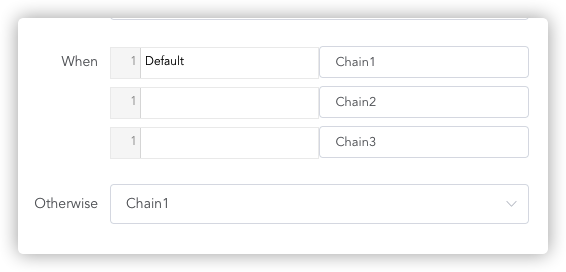

---

### 1.9 ERROR HANDLING

---

#### 1.9.1 Try Catch

**概要**：错误处理组件。

类似于 JAVA

~~~ java
try{
  ...
}catch(Exception e){
  ....
}finally{
  
}
~~~

**使用方法**：

1. > 选择 dotry 分支。

2. > 选择 do finally 分支。

3. > 在branch出输入需要捕获的异常的完全限定名，并选择分支。

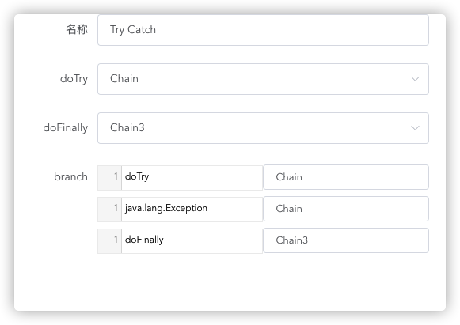

---

### 1.10 SECURITY

---

#### 1.10.1 AES/DES加解密

**概要**：加解密组件，可以对消息体进行AES/DES加解密。

输入会对消息体尝试转byte数组，如果失败则会oos序列化消息体。

加密输出为字符串。解密输出为byte数组。

AES密钥位数为`128bit`

DES密钥位数为`64bit`

**使用方法**：

1. > 输入密钥字符（此处编码为utf-8）

2. > 输入加解密方向。

3. > 选择加解密算法 AES/DES

---

## 2. LANGUAGE

### 2.1 FILE

https://camel.apache.org/components/3.7.x/languages/file-language.html

### 2.2 SIMPLE

https://camel.apache.org/components/3.7.x/languages/simple-language.html

### 2.3 XPATH

https://camel.apache.org/components/3.7.x/languages/xpath-language.html

### 2.4 JSONPATH

https://camel.apache.org/components/3.7.x/languages/jsonpath-language.html

